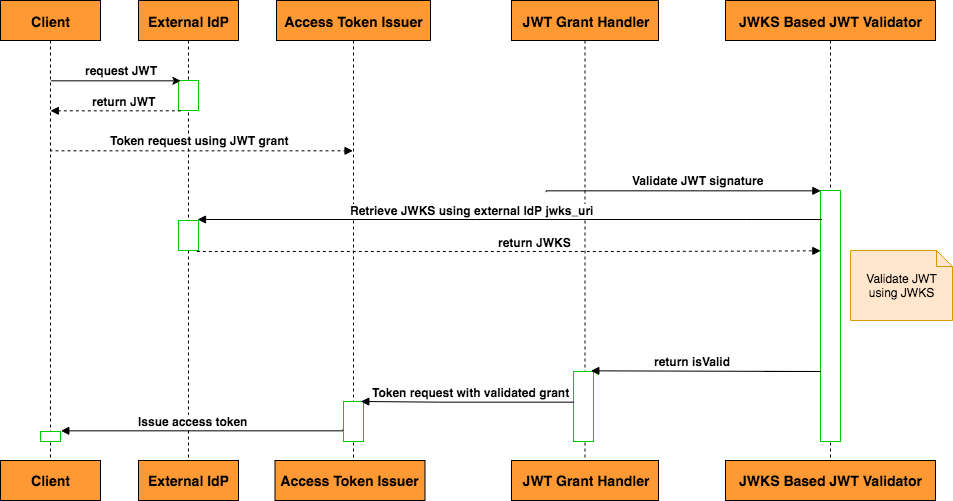

# JSON Web Key Set 

### What is JSON Web Key Set (JWKS) ?
The JSON Web Key Set (JWKS) endpoint is a read-only endpoint that returns
the Authorization server's public key set in the JWKS format. 
This contains the signing key(s) that the Relying Party (RP) uses to validate signatures from the server.
For more information on this endpoint, see the [OpenID Connect Discovery specification](https://openid.net/specs/openid-connect-discovery-1_0.html).


### Usage of JWKS .
The main benefit of allowing JWKS endpoint configuration is its ability to handle key rotation by external identity providers.
Configuring this endpoint would enable you to programmatically discover JSON web keys and allow the third party 
identity providers to publish new keys without having the overhead of notifying each and every client application.
This allows smooth key rollover and integration.

### How it works ?
Following sequence diagram illustrates the scenario where a JWT obtained
from a third party IDP is validated using the JWKS Based JWT Validator.

 

The steps of the above diagram are explained below:

**Step 1:**

-   User requests a JWT assertion from the Identity Provider.

-   A valid JWT is returned with the response

**Step 2:**

-   The user initiates a token request to WSO2 Server’s token endpoint
    using JWT grant type with the obtained JWT assertion.

-   Access Token Issuer handles all the requests sent to the token
    endpoint.

**Step 3:**

-   Access token issuer invokes the JWT Grant Handler to validate the
    provided JWT assertion.

    Deploys and configures the JWT client-handler artifacts

**Step 4:**

-   JWT Grant Handler invokes the JWKS Based JWT validator to validate
    the JWT signature using IDP’s jwks endpoint.

**Step 5:**

-   JWKS Based JWT validator validates the JWT using IDP’s JWKS

**Step 6:**

-   Upon JWT Grant Validation, Access Token issuer issues a new access
    token to the user.

Here, the retrieved JWKS is cached against the jwks\_uri. When
validating a JWT, we use the 'kid' header parameter which is an
indicator for the key used to sign the JWT at the IDP, and compare it
against the JWKS 'kid' properties. If a matched 'kid' is found among the
key set, the JWT will be validated using the corresponding key. In case
of key roll-over at the IDP, the JWT is signed using the new keys and
hence the matching key is not found in the cached JWKS. When a matching
key is not found, the validator retrieves the latest JWKS from the IDP
JWKS endpoint and obtain the matching key for signature validation.

### Sample JSON Web Key Set.

The default JWKS of WSO2 Identity Server is as follows.

```
{ 
   "keys":[ 
      { 
         "kty":"RSA",
         "e":"AQAB",
         "use":"sig",
         "kid":"ZjRmYTMwNTJjOWU5MmIzMjgzNDI3Y2IyMmIyY2EzMjdhZjViMjc0Zg",
         "alg":"RS256",
         "n":"j3mYMT8N2SR8cpimdMOTpk_M8fOxPF1BHQAiCtld4nbksILgJKsA34GSP5Oh4gLW21VCEPPzdGLnqfwM6ZoG_X0rcK5--VbqH_vH4Cclba6fqlLxCvTiRbPJ58Pe7-biCeQ368dG2aeBPV3EhO8br3Z_LcQXASmhSWps8J3GOSx_49xzkHh59J2gJHhnvjxcszZAF35SLAb6F-2rJQrOJs6u7WfJv4NQxSyhcgcr4_-77JzNFEVUj4TPSBy2WGAgK5ttP5-kG3-rKs0lQjTo9h_hK89KjbbRvoqZdpxnwQYxFDOk0CxijZVO5Cs3cabeUHZeXehHSgXj6W-VGMiDgw"
      },
      { 
         "kty":"RSA",
         "e":"AQAB",
         "use":"sig",
         "kid":"ZjRmYTMwNTJjOWU5MmIzMjgzNDI3Y2IyMmIyY2EzMjdhZjViMjc0Zg_RS256",
         "alg":"RS256",
         "n":"j3mYMT8N2SR8cpimdMOTpk_M8fOxPF1BHQAiCtld4nbksILgJKsA34GSP5Oh4gLW21VCEPPzdGLnqfwM6ZoG_X0rcK5--VbqH_vH4Cclba6fqlLxCvTiRbPJ58Pe7-biCeQ368dG2aeBPV3EhO8br3Z_LcQXASmhSWps8J3GOSx_49xzkHh59J2gJHhnvjxcszZAF35SLAb6F-2rJQrOJs6u7WfJv4NQxSyhcgcr4_-77JzNFEVUj4TPSBy2WGAgK5ttP5-kG3-rKs0lQjTo9h_hK89KjbbRvoqZdpxnwQYxFDOk0CxijZVO5Cs3cabeUHZeXehHSgXj6W-VGMiDgw"
      }
   ]
}
``` 

| Property Value                 | Description         | 
| --------------------- | ------------- | 
| kty | The public key type.|                            
| e           | The exponent value of the public key.|                              
| use         | Implies how the key is being used. The value sig represents signature.| 
| kid         | The thumbprint of the certificate. This value is used to identify the key that needs to be used to verify the signature.  | 
| alg         | The algorithm used to secure the JSON Web Signature.  | 
| n           | The modulus value of the public key.  | 

