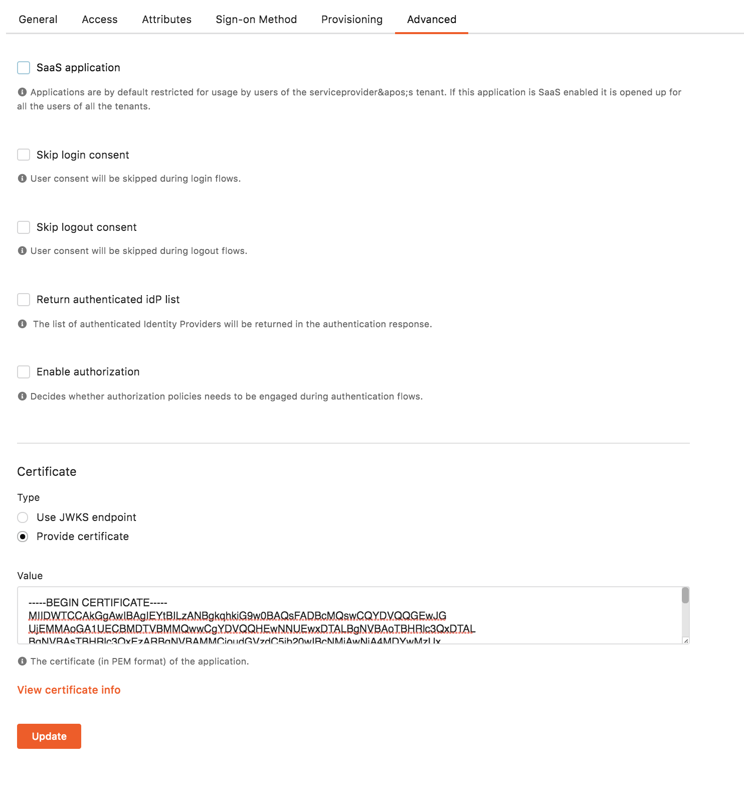

# Use Certificates with Applications

Follow the steps given below to configure your application to use a public certificate instead of the default [JWKS](../../../concepts/authentication/jwks) endpoint. This configuration is required to follow the scenarios mentioned below. 

1.  OIDC Token Encryption
2.  Request Object flow

---

{!fragments/create-certificate.md!}

1.  Navigate to the **Advanced** tab. 

2.  In the **certificate** section, choose **Provide certificate**. 

3.  Paste the public certificate you obtained in the X509 format above in the **Value** text area. 

    

4.  Click **Update**.

---

!!! info "Related Topics" 
    -  [Concept: JWKS](../../../concepts/authentication/jwks)
    -  [Guide: Generate and Encrypt ID Tokens](../oidc-token-encryption)
    -  [Demo: OpenID Connect Token Encryptuon](../../../quick-starts/oidc-token-encryption-sample)
    -  [Guide: Call the JSON Web Key Set (JWKS) Endpoint](../using-jwks)
    -  [Guide: Pass Parameters as a Request Object](../request-object)