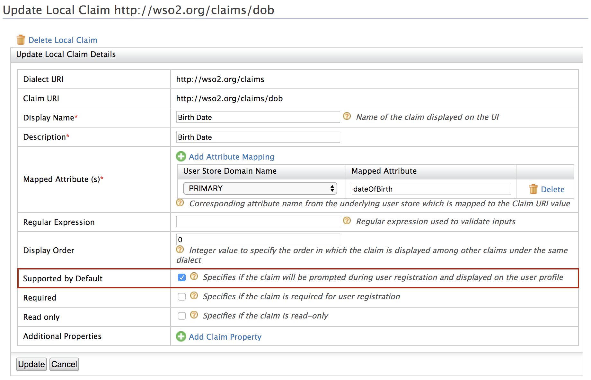
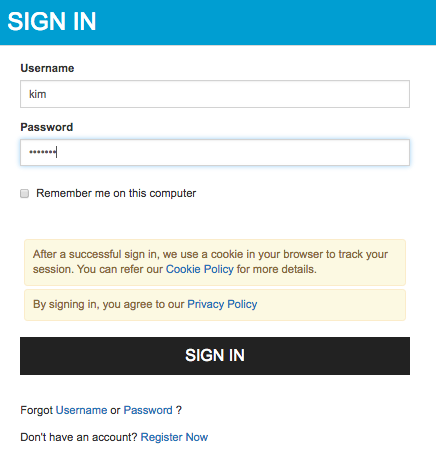
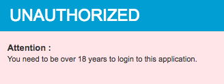

# Adaptive Authentication Using Function Library

This page guides you through configuring adaptive authentication using the function library for a sample web application.

----

If you have your own application, click the button below.

<a class="samplebtn_a" href="../../guides/adaptive-auth-with-function-lib"   rel="nofollow noopener">I have my own application</a>

-----

## Scenario

The instructions below guide you through adding an adaptive authentication function using the function library that specifies authentication based on the user's age. In this example, any user who is underage and below the specified age limit (i.e., under the age of 18 years) is restricted access and prevented from logging in to the application.

----
## Set up Pickup Dispatch sample

{!fragments/pickup-dispatch-saml.md!}

----

{!fragments/add-function-library.md!}

Add a function library with the following properties.
    
- **Function Library Name:** age_based
- **Description:** getAge of the user 
- **Function Library Script:** 
    
    ```javascript
    function getAge(birthDate) {
        var today = new Date();
        var age = today.getFullYear() - birthDate.getFullYear();
        var m = today.getMonth() - birthDate.getMonth();
        if (m < 0 || (m === 0 && today.getDate() < birthDate.getDate())) {
            age--;
        }
        return age;
    }
     module.exports.getAge = getAge;
    ```

----

## Configure claims 

1. On the management console, click **Claims > List**.

2. Click `http://wso2.org/claims`. 

3. Click the **Edit** link corresponding to the **BirthDate** claim.

4. Select the **Supported By Default** checkbox to enable the birth date claim. 

    

5. Create a user called "Alex" and edit the user profile.

    For instructions, see [Adding Users and Roles](insertlink).

6. Enter a birth date that specifies Alex as under 18 years of age. 

    !!! note
        Enter the birth date in the following format: `<yyyy-mm-dd>`.

7. Create another user called "Kim" and edit the user profile. Enter a birth date that specifies Kim as over 18 years of age. 

-----

## Configure authentication script

1. Click **Service Providers > List** and click **Edit** on the `saml2-web-app-pickup-dispatch.com` service provider.

2. Expand **Local and Outbound Authentication Configuration** and click **Advanced Configuration**.

3. Under script based adaptive authentication editor, enter the following script.

    ```javascript
    var ageModule = require('age_based.js');

    //This script provides access to application only if the user's age is greater than the configured value

    //The user will be redirected to an error page if the date of birth is not present or the user's age is below the configured value
    
    var ageLimit = 18;
    
    // Error page to redirect unauthorized users.
    // Can either be an absolute URL or a relative URL to the server root. The value can be empty or null as well.
    // null/empty value will redirect to the default error page
    var errorPage = '';
    
    // Additional query params to be added to the above url.
    // Hint: Use i18n keys for error messages
    
    var errorPageParameters = {
        'status': 'Unauthorized',
        'statusMsg': 'You need to be over ' + ageLimit + ' years to login to this application.'
    };
    
    // Date of birth attribute at the client side
    var dateOfBirthClaim = 'http://wso2.org/claims/dob';
    
    function onLoginRequest(context) {
        executeStep(1, {
            onSuccess: function (context) {
                var underAge = true;
                // Extracting user store domain of authenticated subject from the first step
                var dob = context.currentKnownSubject.localClaims[dateOfBirthClaim];
                Log.debug('DOB of user ' + context.currentKnownSubject.identifier + ' is : ' + dob);
                if (dob && ageModule.validateDOB(dob)) {
                    var birthDate = new Date(dob);
                    if (ageModule.getAge(birthDate) >= ageLimit) {
                        underAge = false;
                    }
                }
                if (underAge === true) {
                    Log.debug('User ' + context.currentKnownSubject.identifier + ' is under aged. Hence denied to login.');
                    sendError(errorPage, errorPageParameters);
                }
            }
        });
    }
    ```
    The authentication script and authentication steps get configured. 
    The authentication script grants access only to users who are 18 years or above 
    and restricts underage users. Underage users are redirected to an error page. 
    
    !!! note
        Add `var ageModule=require('age_based.js'); before ageModule.getAge(birthDate)` and `ageModule.validateDOB(dob) functions’` usage.


4. Click **Ok**, then **Update**.

## Testing the sample scenario

1. Access the following sample PickUp application URL: 

    <http://localhost.com:8080/saml2-web-app-pickup-dispatch.com>

2. Click **Login** and enter Kim's credentials. 

    

3. You are successfully logged in to the application.

4. Log out and login as Alex. Note that you are now restricted from logging in because Alex is underage.  

    
